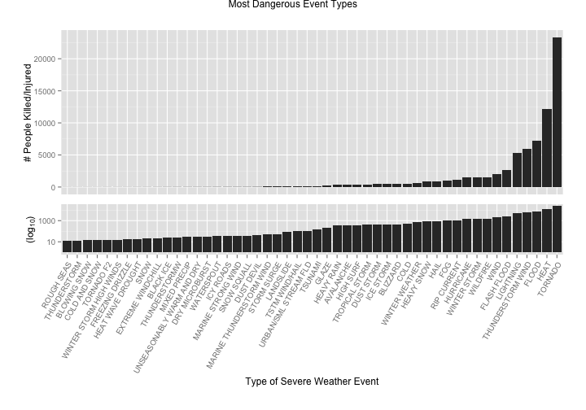
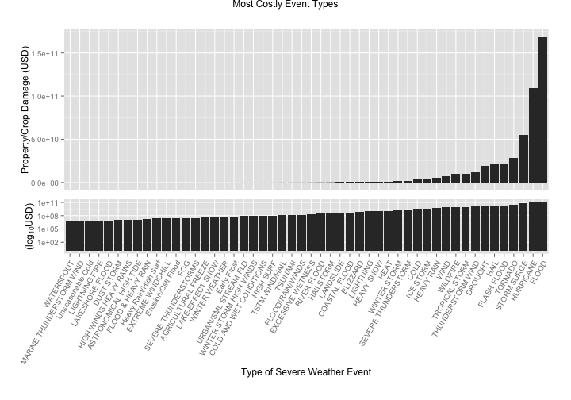
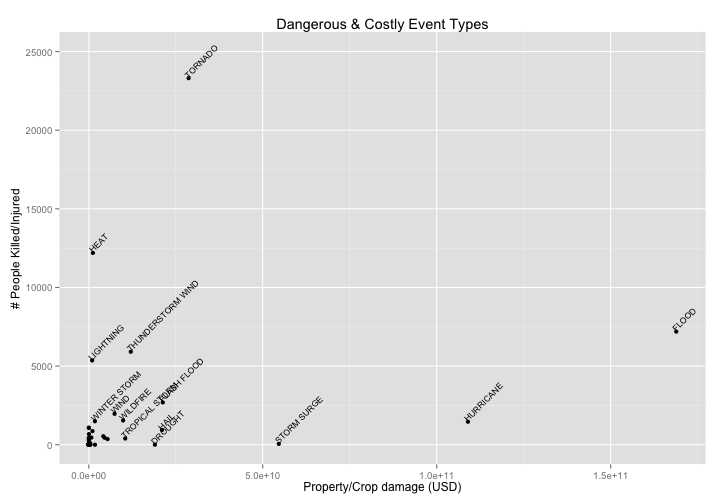

Most Severe Weather Events Impacting Health and Economy
=======================================================

## Synopsis

In this report we aim to answer some basic questions about severe weather
events.  Specifically, we try to identify which types of events are the most
harmful to population health and the most deleterious to the economy.
To answer these questions, we obtained the storm database from the
U.S. National Oceanic and Atmospheric Administration's (NOAA).  This database
tracks characteristics of major storms and weather events in the United States,
including estimates of any fatalities, injuries, and property and crop damage.
From these data, we found that tornadoes and heat are the severe weather
event types by far most dangerous to people, while flooding, hurricanes, and storm
surges are the most costly event types to the economy.  Interestingly, only
flooding is one of the top three most dangerous or most costly event types.

## Data Processing


```r
library(R.utils)
library(data.table)
library(ggplot2)
library(gridExtra)
library(dplyr)
library(quantmod)
```


### Getting and Loading the Data

From the Coursera "Reproducible Research" course
[file repository](https://d396qusza40orc.cloudfront.net/repdata%2Fdata%2FStormData.csv.bz2),
we obtain the storm data in bzip archive format and extract it.

```{ r download.data,cache=T,eval=F}
download.file("http://d396qusza40orc.cloudfront.net/repdata%2Fdata%2FStormData.csv.bz2", destfile="repdata-data-StormData.csv.bz2")

bunzip2("repdata-data-StormData.csv.bz2", overwrite=T, remove=F)
```

We read in the extracted file, which is in CSV format, into a data frame, which we
then convert to a data.table for efficiency of later operations.


```r
storm = read.csv("repdata-data-StormData.csv")
# storm = read.csv('slice.csv')
storm = data.table(storm)
```


We check the first few rows in the dataset, which should have 902297 rows in total.


```r
dim(storm)
```

```
## [1] 902297     37
```

```r
head(storm, n = 3)
```

```
##    STATE__          BGN_DATE BGN_TIME TIME_ZONE COUNTY COUNTYNAME STATE
## 1:       1 4/18/1950 0:00:00     0130       CST     97     MOBILE    AL
## 2:       1 4/18/1950 0:00:00     0145       CST      3    BALDWIN    AL
## 3:       1 2/20/1951 0:00:00     1600       CST     57    FAYETTE    AL
##     EVTYPE BGN_RANGE BGN_AZI BGN_LOCATI END_DATE END_TIME COUNTY_END
## 1: TORNADO         0                                               0
## 2: TORNADO         0                                               0
## 3: TORNADO         0                                               0
##    COUNTYENDN END_RANGE END_AZI END_LOCATI LENGTH WIDTH F MAG FATALITIES
## 1:         NA         0                      14.0   100 3   0          0
## 2:         NA         0                       2.0   150 2   0          0
## 3:         NA         0                       0.1   123 2   0          0
##    INJURIES PROPDMG PROPDMGEXP CROPDMG CROPDMGEXP WFO STATEOFFIC ZONENAMES
## 1:       15    25.0          K       0                                    
## 2:        0     2.5          K       0                                    
## 3:        2    25.0          K       0                                    
##    LATITUDE LONGITUDE LATITUDE_E LONGITUDE_ REMARKS REFNUM
## 1:     3040      8812       3051       8806              1
## 2:     3042      8755          0          0              2
## 3:     3340      8742          0          0              3
```


### Restricting to recent years

The events in the database start in the year 1950 and end in November 2011. In the earlier years of the database there are generally fewer events recorded, most likely due to a lack of good records. More recent years should be considered more complete.

One concern is that there may be an inconsistence balance of event types
recorded over the years.  For example, maybe in the earlier years, deaths due
to rip currents were not recorded.  To allow for more fair comparisons,
we want to restrict our analysis to years that demonstrate a large number of
recorded events, as this may indicate better record-keeping.

So we count the number of events per year.


```r
storm$year = as.numeric(format(as.Date(storm$BGN_DATE, format = "%m/%d/%Y %H:%M:%S"), 
    "%Y"))

stormsByYear = storm[, lapply(.SD, length), by = year, .SDcols = 1]
setnames(stormsByYear, 2, "count")

# ggplot(stormsByYear) + geom_line(aes(year, count))
```


From a plot, we see that the number of events tracked starts to significantly pick up around 1995.
So we restrict the dataset to those recent events, in the hope that we get a more
consistent balance of event types across recent years.


```r
storm = storm[year >= 1995]
dim(storm)
```

```
## [1] 681500     38
```


### Computing damage values

We convert the property damage and crop damage data into comparable numerical form,
based on the meaning of units described in the code book (National Climatic Data Center's
[record layout document](http://ire.org/media/uploads/files/datalibrary/samplefiles/Storm%20Events/layout08.doc),
which is referenced on the
[Investigative Reporers & Editors](http://ire.org/nicar/database-library/databases/storm-events/)
web site.)


```r
storm$PROPDMGEXP = as.character(storm$PROPDMGEXP)
storm$PROPDMGEXP[toupper(storm$PROPDMGEXP) == "B"] = "9"
storm$PROPDMGEXP[toupper(storm$PROPDMGEXP) == "M"] = "6"
storm$PROPDMGEXP[toupper(storm$PROPDMGEXP) == "K"] = "3"
storm$PROPDMGEXP[toupper(storm$PROPDMGEXP) == "H"] = "2"
storm$PROPDMGEXP = as.numeric(storm$PROPDMGEXP)
storm$PROPDMGEXP[is.na(storm$PROPDMGEXP)] = 0
storm$PropertyDamage = storm$PROPDMG * 10^storm$PROPDMGEXP
summary(storm$PropertyDamage)
```

```
##      Min.   1st Qu.    Median      Mean   3rd Qu.      Max. 
## 0.000e+00 0.000e+00 0.000e+00 5.539e+05 1.500e+03 1.150e+11
```


```r
storm$CROPDMGEXP = as.character(storm$CROPDMGEXP)
storm$CROPDMGEXP[toupper(storm$CROPDMGEXP) == "B"] = "9"
storm$CROPDMGEXP[toupper(storm$CROPDMGEXP) == "M"] = "6"
storm$CROPDMGEXP[toupper(storm$CROPDMGEXP) == "K"] = "3"
storm$CROPDMGEXP[toupper(storm$CROPDMGEXP) == "H"] = "2"
storm$CROPDMGEXP[toupper(storm$CROPDMGEXP) == ""] = "0"
storm$CROPDMGEXP = as.numeric(storm$CROPDMGEXP)
storm$CROPDMGEXP[is.na(storm$CROPDMGEXP)] = 0
storm$CropDamage = storm$CROPDMG * 10^storm$CROPDMGEXP
summary(storm$CropDamage)
```

```
##      Min.   1st Qu.    Median      Mean   3rd Qu.      Max. 
## 0.000e+00 0.000e+00 0.000e+00 5.531e+04 0.000e+00 1.510e+09
```


We consider both property and crop damage as important components of the
economic impact of weather events.  So we sum them up, even though property
damage figures dominates those for crop damage.


```r
storm$TotalDamage = storm$PropertyDamage + storm$CropDamage
summary(storm$TotalDamage)
```

```
##      Min.   1st Qu.    Median      Mean   3rd Qu.      Max. 
## 0.000e+00 0.000e+00 0.000e+00 6.092e+05 2.000e+03 1.150e+11
```


#### Adjusting for inflation

We adjust for inflation using the Consumer Price Index.


```r
invisible(getSymbols("CPIAUCSL", src = "FRED"))
yearlyCPI = apply.yearly(CPIAUCSL, mean)
yearlyCPI.in2011Dollars = as.numeric(yearlyCPI["2011"])/yearlyCPI
cpiAdj = as.data.frame(yearlyCPI.in2011Dollars)
cpiAdj$year = as.numeric(format(as.Date(rownames(cpiAdj)), "%Y"))
colnames(cpiAdj)[1] = "CPIConv"
head(cpiAdj, n = 3)
```

```
##              CPIConv year
## 1947-12-01 10.072330 1947
## 1948-12-01  9.354623 1948
## 1949-12-01  9.447282 1949
```

```r

storm = merge(storm, cpiAdj, by = "year")
storm$TotalDamage = storm$TotalDamage * storm$CPIConv
```


### Cleaning up most relevant event types

Since the event types in the data are inconsistently named, we manually
merge a few event types.  Since there are close to 1000 different levels in the
event type factor and it would be too time-consuming to process them all,
we focus on about 80 of the most significant event types.  This focus should not affect
our analysis as we are seeking to identify only the most impactful event types.
Event types are considered significant if they have high total damage.

For example, in the list below, we should combine "HURRICANE OPAL",
"HURRICANE" and "HURRICANE/TYPHOON".


```r
tail(sort(tapply(storm$TotalDamage, storm$EVTYPE, sum)), n = 20)
```

```
##       SEVERE THUNDERSTORM              EXTREME COLD 
##                1772063974                1839085525 
## HEAVY RAIN/SEVERE WEATHER         THUNDERSTORM WIND 
##                3690231598                3994317499 
##          WILD/FOREST FIRE                 ICE STORM 
##                4103426232                4562339127 
##            HURRICANE OPAL          STORM SURGE/TIDE 
##                4711460386                4849098656 
##                  WILDFIRE                 TSTM WIND 
##                5745526146                6556403845 
##                 HIGH WIND            TROPICAL STORM 
##                6940700239               10428935790 
##                   DROUGHT                 HURRICANE 
##               18997384877               19018938872 
##               FLASH FLOOD                      HAIL 
##               20862990849               20994604473 
##                   TORNADO               STORM SURGE 
##               28685394837               49768053693 
##         HURRICANE/TYPHOON                     FLOOD 
##               83661619975              168834543607
```


```r
storm$EVTYPE[toupper(storm$EVTYPE) %in% c("HURRICANE/TYPHOON", "HURRICANE OPAL", 
    "HURRICANE OPAL/HIGH WINDS", "HURRICANE EMILY", "TYPHOON", "HURRICANE ERIN")] = "HURRICANE"
storm$EVTYPE[toupper(storm$EVTYPE) %in% c("TSTM WIND", " TSTM WIND", "SEVERE THUNDERSTORM WINDS", 
    "THUNDERSTORM WINDS")] = "THUNDERSTORM WIND"
storm$EVTYPE[toupper(storm$EVTYPE) %in% c("HEAVY RAIN/SEVERE WEATHER", "EXCESSIVE RAINFALL", 
    "UNSEASONAL RAIN", "HEAVY RAINS")] = "HEAVY RAIN"
storm$EVTYPE[toupper(storm$EVTYPE) %in% c("STORM SURGE/TIDE")] = "STORM SURGE"
storm$EVTYPE[toupper(storm$EVTYPE) %in% c("WILD/FOREST FIRE", "WILDFIRES", "WILD FIRES")] = "WILDFIRE"
storm$EVTYPE[toupper(storm$EVTYPE) %in% c("EXCESSIVE HEAT", "HEAT WAVE", "EXTREME HEAT", 
    "UNSEASONABLY WARM", "RECORD/EXCESSIVE HEAT", "RECORD HEAT")] = "HEAT"
storm$EVTYPE[toupper(storm$EVTYPE) %in% c("EXTREME COLD", "FROST/FREEZE", "FROST", 
    "Early Frost ", "DAMAGING FREEZE", "RECORD COLD", "COLD/WIND CHILL", "EXTREME COLD/WIND CHILL", 
    "UNSEASONABLY COLD", "Unseasonable Cold", "HARD FREEZE", "FREEZE")] = "COLD"
storm$EVTYPE[toupper(storm$EVTYPE) %in% c("HIGH WINDS", "HIGH WIND", "BLOWING WIND", 
    "STRONG WINDS", "STRONG WIND")] = "WIND"
storm$EVTYPE[toupper(storm$EVTYPE) %in% c("FLASH FLOODING", "FLASH FLOOD/FLOOD", 
    "FLOOD/FLASH FLOOD")] = "FLASH FLOOD"
storm$EVTYPE[toupper(storm$EVTYPE) %in% c("SMALL HAIL")] = "HAIL"
storm$EVTYPE[toupper(storm$EVTYPE) %in% c("RIVER FLOODING")] = "RIVER FLOOD"
storm$EVTYPE[toupper(storm$EVTYPE) %in% c("FLOODING", "MAJOR FLOOD")] = "FLOOD"
storm$EVTYPE[toupper(storm$EVTYPE) %in% c("COASTAL FLOODING", "COASTAL FLOODING/EROSION", 
    "COASTAL  FLOODING/EROSION", "Erosion/Cstl Flood", "COASTAL FLOOD")] = "COASTAL FLOOD"
```


We also look at about 80 of the most significant event types with respect to injuries and
fatalities and again merge the terms that represent the same type of event.


```r
storm$TotalPeople = storm$INJURIES + storm$FATALITIES
tail(sort(tapply(storm$TotalPeople, storm$EVTYPE, sum)), n = 20)
```

```
##    WINTER WEATHER        DUST STORM         ICE STORM          BLIZZARD 
##               431               441               441               456 
##      RIP CURRENTS              COLD       RIP CURRENT               FOG 
##               501               540               587               779 
##        HEAVY SNOW              HAIL         HURRICANE      WINTER STORM 
##               866               936              1462              1493 
##          WILDFIRE              WIND       FLASH FLOOD         LIGHTNING 
##              1543              1965              2689              5360 
## THUNDERSTORM WIND             FLOOD              HEAT           TORNADO 
##              5910              7194             12197             23310
```


```r
storm$EVTYPE[toupper(storm$EVTYPE) %in% c("TROPICAL STORM GORDON", "TROPICAL STORM JERRY")] = "TROPICAL STORM"
storm$EVTYPE[toupper(storm$EVTYPE) %in% c("DENSE FOG")] = "FOG"
storm$EVTYPE[toupper(storm$EVTYPE) %in% c("RIP CURRENTS")] = "RIP CURRENT"
storm$EVTYPE[toupper(storm$EVTYPE) %in% c("HEAVY SURF", "HEAVY SURF/HIGH SURF")] = "HIGH SURF"
storm$EVTYPE[toupper(storm$EVTYPE) %in% c("WATERSPOUT/TORNADO")] = "WATERSPOUT"
storm$EVTYPE[toupper(storm$EVTYPE) %in% c("WINTRY MIX", "WINTER WEATHER MIX", 
    "WINTER WEATHER/MIX")] = "WINTER WEATHER"
storm$EVTYPE[toupper(storm$EVTYPE) %in% c("WINTER STORMS")] = "WINTER STORM"
storm$EVTYPE[toupper(storm$EVTYPE) %in% c("MARINE TSTM WIND")] = "MARINE THUNDERSTORM WIND"
```


## Results

When we analyze the data, we look at total numbers in aggregate.
We don't look at yearly averages because there are many
significant events that happen only once every few years, for example massive
hurricanes and floods.

### Dangerous Event Types

We look at the number of people killed or hurt per event type, for the
50 most dangerous event types:


```r
dangerous = as.data.frame.table(tail(sort(tapply(storm$TotalPeople, storm$EVTYPE, 
    sum)), n = 50))
colnames(dangerous) = c("EventType", "TotalPeople")
p1 = ggplot(data = dangerous, aes(x = EventType, y = TotalPeople)) + theme(plot.margin = unit(c(1, 
    1, -0.2, 0.91), "cm")) + geom_bar(stat = "identity") + labs(x = "", y = "# People Killed/Injured")
p2 = p1 + scale_y_log10() + theme(plot.margin = unit(c(-0.2, 1, 1, 1), "cm")) + 
    theme(axis.text.x = element_text(angle = 60, hjust = 1)) + labs(y = expression(paste("(", 
    log[10], ")"))) + xlab("Type of Severe Weather Event")
p1 = p1 + theme(axis.text.x = element_blank(), axis.ticks.x = element_blank())
grid.arrange(p1, p2, nrow = 2, main = "Most Dangerous Event Types")
```

 


We can see from the skew of the graph that certain event types are the most
dangerous to the health of the population, most notably tornadoes and heat.
In fact, we have to also plot in
logarithmic scale in order to be able to compare the less dangerous event types.

### Costly Event Types

We now look at total property and crop damage per event type, for the 50
most costly event types.


```r
ruinous = as.data.frame.table(tail(sort(tapply(storm$TotalDamage, storm$EVTYPE, 
    sum)), n = 50))
colnames(ruinous) = c("EventType", "TotalDamage")
p1 = ggplot(data = ruinous, aes(x = EventType, y = TotalDamage)) + theme(plot.margin = unit(c(1, 
    1, -0.2, 0.82), "cm")) + geom_bar(stat = "identity") + labs(x = "", y = "Property/Crop Damage (USD)")
p2 = p1 + scale_y_log10() + theme(plot.margin = unit(c(-0.2, 1, 1, 1), "cm")) + 
    theme(axis.text.x = element_text(angle = 60, hjust = 1)) + labs(y = expression(paste("(", 
    log[10], "USD)"))) + xlab("Type of Severe Weather Event")
p1 = p1 + theme(axis.text.x = element_blank(), axis.ticks.x = element_blank())
grid.arrange(p1, p2, nrow = 2, main = "Most Costly Event Types")
```

 


As with dangerous event types, we can see from the skew of the graph that
certain event types are
disproportionately costly to the economy, most notably flood, hurricane, and storm
surge.  Once again, we have to also plot in
logarithmic scale in order to be able to compare the less costly event types.

### Dangerous & Costly Event Types

We also want to look at which event types are harmful both for people and property.

We narrow down to the top 10 in each dimension.


```r
dangerous10 = tail(sort(tapply(storm$TotalPeople, storm$EVTYPE, sum)), n = 10)
ruinous10 = tail(sort(tapply(storm$TotalDamage, storm$EVTYPE, sum)), n = 10)
impactfulEvTypes = unique(c(names(ruinous10), names(dangerous10)))
```


We can now see which event types are particularly dangerous or particularly
costy or both.
  

```r
# Using dplyr
impact = storm %.% group_by(EVTYPE) %.% summarize(TotalDamage = sum(TotalDamage), 
    TotalPeople = sum(TotalPeople))
impact[!(impact$EVTYPE %in% impactfulEvTypes), "EVTYPE"] = ""
ggplot(impact) + aes(y = TotalPeople, x = TotalDamage, label = EVTYPE) + geom_point() + 
    ggtitle("Dangerous & Costly Event Types") + labs(y = expression(paste("# People Killed/Injured")), 
    x = expression(paste("Property/Crop damage (USD)"))) + geom_text(angle = 45, 
    vjust = 0, hjust = 0, size = 3) + ylim(0, 25000)
```

 


From this plot, we can see that the most impactful event types are either
very dangerous to the population or very costly, but generally not at the same time.
For example, heat injures and kills many people but is not particularly costly.
Similarly, storm surge is costly but is relatively harmless to people.

Tornadoes are the most dangerous to people but storm surges, hurricanes,
and floods are most costly.  Also, flooding is the most costly, but heat
and tornadoes injure or kill more people.

```


```
